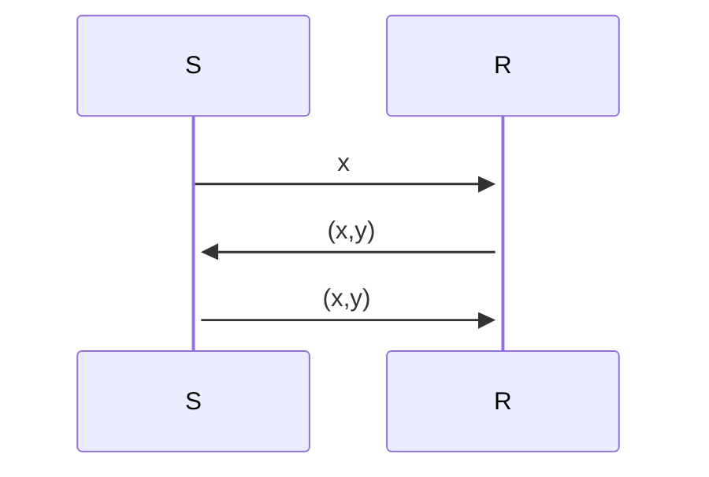

## Protocols 
* The problem
	* How should a system share messages between each other?
	* A sends a message to B
	* How should the message passing be implemented?
### ACK
* The simplest solution for this problem is the ACK Protocol
	* Two processes - sender and receiver
	* When the sender gets the message from A transmit it to the receiver which then passes it along to B. The receiver then transmits an acknowledge back to the sender informing that the message has been received.
* In pseudocode
	 ```c
	* Sender = wait for x $\in$ M.
			     Q(x)
	* Q(x $\in$ M) = send x to R
				wait for ACK from R
				Sender
	```

	```c
	* Receiver = wait for x from S
				send ACK to S (*)
				output x
				Receiver
	```
### ACK/NACK 
* The ACK protocol implements the RMI semantic called Maybe semantics.
	* This scheme gives no guarantees, and can easily deadlock.
	* Maybe semantics is a lightweight way to implement remote invocation.

* What could happen if a message is corrupted?
	* The solution is the **Simple ACK/NACK Protocol**
	* M = domain of correct messages
	* M' = domain of corrupted messages
	* M and M' = {}
	* "checksum" model: x $\in$ M or  x $\in$ M'
* Pseudocode
	* Sender =
		```c
		Q(x $\in$ M) = send x to R
				     wait for y from R
				     if y == ACK then Sender
				     else if y == NACK then Q(x)
		```
	* Reciever =
```c
		wait for x from S
		if x x $\in$ M then (*)
		else if x $\in$ M' then
						send NACK to S
						Reciever
```
* The ACK/NACK is still a Maybe semantic

* Alternative strategy to the ACK/NACK protocol is using **Polling**
	* Polling is implemented by making the receiver take the initiative
	* POLL: Request to send data
	* REPT: request to repeat transmission due error in data received
### ACK/NACK + TIMEOUT
* Big problem with ACK/NACK is deadlocks, due to no handling if no ACK/NACK is never received.
* Solution for deadlock is to implement a **TIMEOUT** to the ACK/NACK protocol
	* After a specific amount of time if no ACK/NACK, then retransmit.
```c
Sender = 
		Q(x in M) = send x to R
					start timer(s)
					wait for (msg y from R or timeout)
					if msg y from R then {if y == ACK then
												Reset timer
												Sender
										  else if y == NACK then
												  Reset timer
												  Q(x)
										 }
					else Reset timer // Timeout
						 Q(x)
```
* Implements the at-least-once semantic

* This protocol has a duplication problem.
	* If the acknowledge gets lost, the sender will eventually timeout and send the same message once again.
	* This results in a duplication 

* Possible solution for this problem is the numbering scheme
	* Introducing a number scheme for the messages, allows the receiver to filter of duplicated messages.

### PAR Protocols (ACK + TIMEOUT + NUMBERING SCHEME)
* We can remove the NACK as the TIMEOUT solves the same problem
	* Negative acknowledgements only have an effect on the response time.
	* A NACK has to influence on the protocols logical properties.
* Protocols with only an ACK and a timeout, are called Positive acknowledge and Retransmission protocols (PAR)

```c
Sender = S(1)  
	S(n ∈ N 0) = wait for input x ∈ M;  
							   Q(n, x)  
	Q(n ∈ N 0 , x ∈ M) = send (n, x) to Receiver;  
						 start timer(s);  
						 wait until (receipt of msg y from Receiver OR timeout);  
						 if receipt of msg y == ACK from Receiver then {  
												reset timer;  
												S(succ(n))}  
						else { // timeout  
								reset timer;  
								Q(n, x)}
```

```c
Receiver = R(0)  
	R(n ∈ N) = wait until receipt of msg (i, x) from Sender;  
			if x ∈ M then {  
				if i = succ(n) then { // expected msg  
					send ACK to Sender;  
					output x;  
					R(succ(n)}  
				else if i = n then { // same msg  
					send ACK to Sender;  
					R(n)}  
				else R(n)}  
			else if x ∈ M’ then R(n)
```

* Implements the At-most-once semantic

#### Floating Corpses
* A floating corpse is a message that has been lost for some time.
	* The message is then retransmitted
	* At some point the lost message will arrive and cause confusion
* PAR protocol
	* An example is if msg1 is lost, and then retransmitted. Then if the lost msg1 arrives before msg2, the receiver can send a false ACK. Which can be a problem if msg2 gets corrupted.
	* This happens due to no sequence number on the receiver as such all ACKs are treated equal
	* ![[Pasted image 20230209150529.png]]
* Is only a problem due to anonymous acknowledge from the receiver
### PAR Protocol + NUMBERED ACK
* See pseudocode document for code.

## Protocols for exchange of State of Information
* Before exchanging data, sender and receiver does a *"handshake"*
	* Agree to establish connection
	* Agree on connection parameters
* Two-Way exchange Protocol is known as the *"handshake"*
* Three-Way exchange Protocol is one of the most used modern protocols. F.x. TCP uses this protocol.
	* The general scheme is:
		* Initiating entity sends a request
		* The responding entity replies with a response message
		* The initiating entity then repeats this message as an extra confirmation.
* The three way is a combination of 2 two-way protocols.
* Example of the Three-Way protocol


 